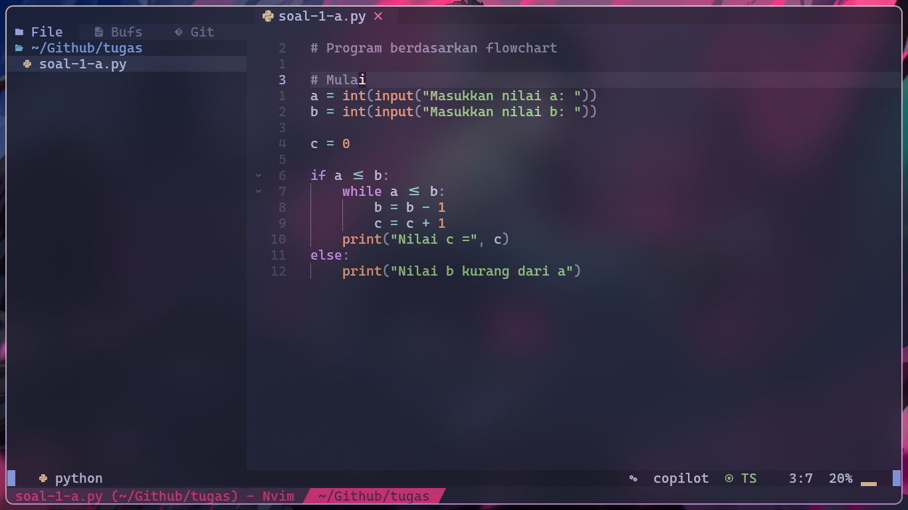
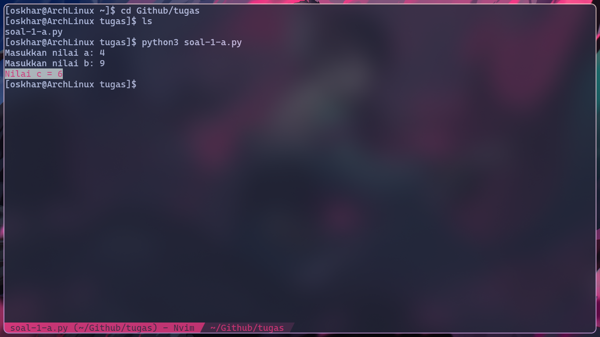
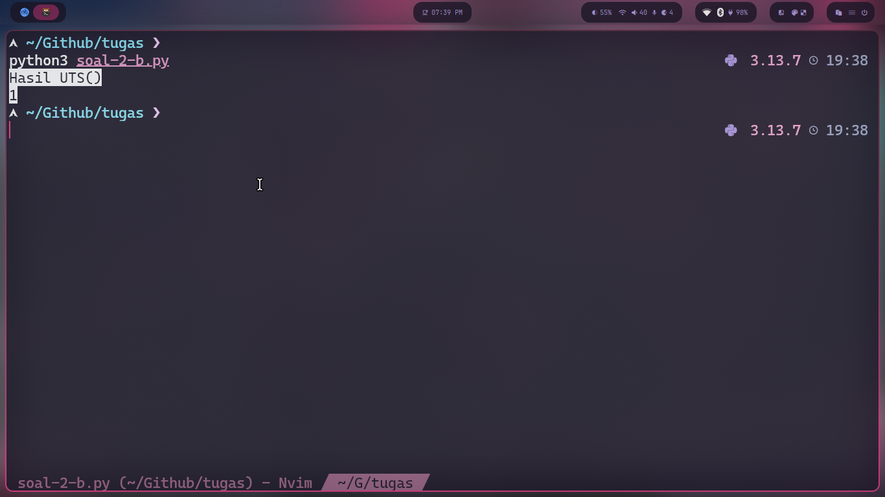
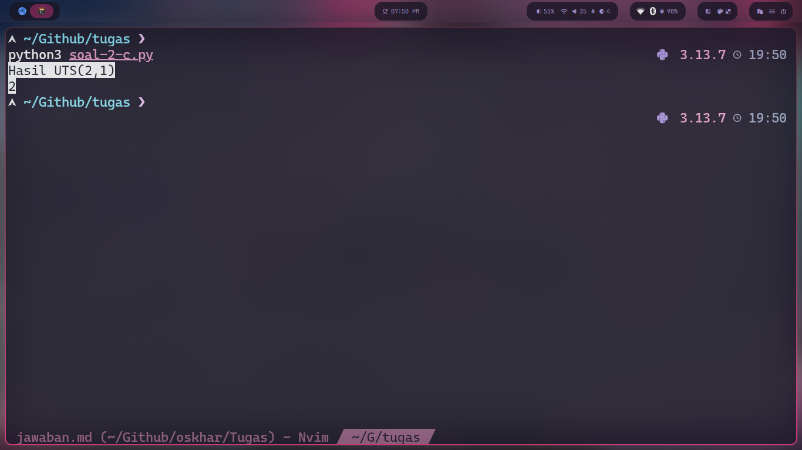

# Jawaban

## 1.)

## a.)

**Screenshot**  


**Tulis langsung**

```python
# Program berdasarkan flowchart

# Mulai
a = int(input("Masukkan nilai a: "))
b = int(input("Masukkan nilai b: "))

c = 0

if a <= b:
    while a <= b:
        b = b - 1
        c = c + 1
    print("Nilai c =", c)
else:
    print("Nilai b kurang dari a")
```

## b.)

jawabannya adalah 6  
output:  


## 2.)

## a.)

penjelasan perbaris

`def UTS(a=2 ,b=3):` \-\> mendefinisikan fungsi UTS dengan nilai default a adalah 2 dan nilai default b 3  
`def UTS1(y, z):` \-\> mendefinisikan fungsi UTS1 dengan 2 parameter y dan z  
`return z//y` \-\> mengembalikan hasil dari ekspresi pembagian yang dibulatkan antara z dan y  
`return UTS1(a, b)+ UTS1(b, a)` \-\> mengembalikan hasil dari perjumlahan 2 fungsi

## b.)

karena nilai default jika tidak diinputkan adalah a \= 2 dan b \= 3  
`a = 2`  
`b = 3`

penjelasan  
`UTS1(y,z) = hasil pembulatan dari z/y`

hasil akhir dari UTS(a,b) \= UTS1(a,b) \+ UTS1(b,a)  
jadi  
`UTS1(2, 3) = 3 // 2 = 1`  
`UTS1(3, 2) = 2 // 3 = 0`  
`UTS = UTS1(2, 3) + UTS1(3, 2) = 1 + 0 = 1`  
`Jawabannya adalah 2`

*Pembuktian program*


## c.)

`a = 2`  
`b = 1`

penjelasan  
`UTS1(y,z) = hasil pembulatan dari z/y`

hasil akhir dari UTS(a,b) \= UTS1(a,b) \+ UTS1(b,a)  
jadi  
`UTS1(2, 1) = 1 // 2 = 0`  
`UTS1(1, 2) = 2 // 1 = 2`  
`UTS = UTS1(2, 1) + UTS1(1, 2) = 0 + 2 = 2`  
`Jawabannya adalah 2`

*Pembuktian program*


## 3.)

